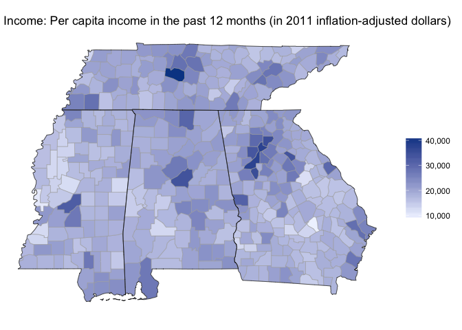

Visualization samples
================

Choropleth maps
---------------

Below are some examples of a simple choropleth map using choroplethR from Ari Lamstein, which is a terrific package.

First, here is the population for a select number of southern states using the ACS data set and the most recent 5 year file. 

And then, using the same data source, here is a snapshot of income for the same states. 

#### Examining distribution of race within Tennessee

(work in progress)

Leaflet maps (to come)
----------------------
